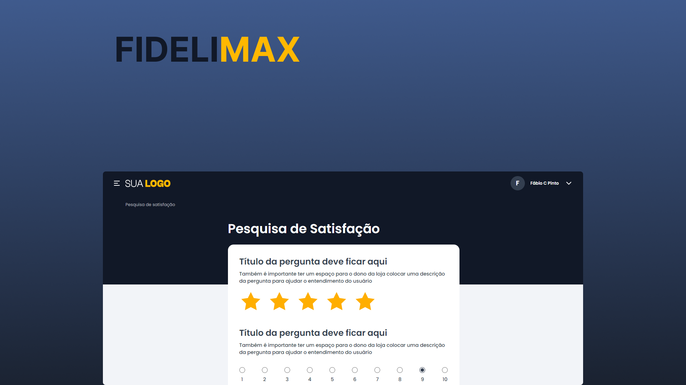

# Desafio Front-end
Minha resolução proposto pela da empresa @fidelimax. O projeto tem como objetivo responder perguntas dinâmicas utilizando NextJS e tailwindCSS. 🚀 <br><br>



## 🚀 Tecnologias
- ✔️ NextJS - Framework React
- ✔️ React Hook Form - Lib para controle de formulários
- ✔️ Typescript - Superset do Javascript
- ✔️ Lucide Icons - Biblioteca de ícones
- ✔️ axios - Comunicação de dados

## 📦️ Pré-Requisitos
Antes de começar você vai precisar ter instalado na sua máquina as ferramentas [Git](https://git-scm.com/) e [Node](https://nodejs.org/en/download/).

## ⚡ Executando o projeto
1. Clone o repositório
```
    git clone https://github.com/DouglasLacerdaC/fidelimax.git
```
2. Acesse a pasta do projeto e instale as dependências
```
    npm install
```
3. Execute o projeto
```
    npm run dev
```
4. Acesse pelo navegador
```
    http://localhost:3000/
```

Desenvolvido por [Douglas Lacerda](https://www.linkedin.com/in/douglas-lacerda-da-conceicao/) 🤠